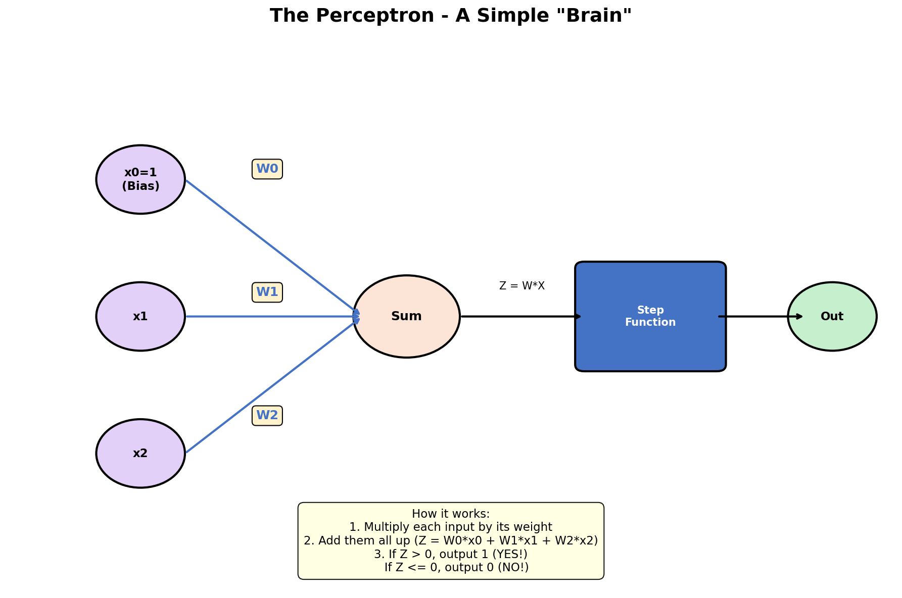
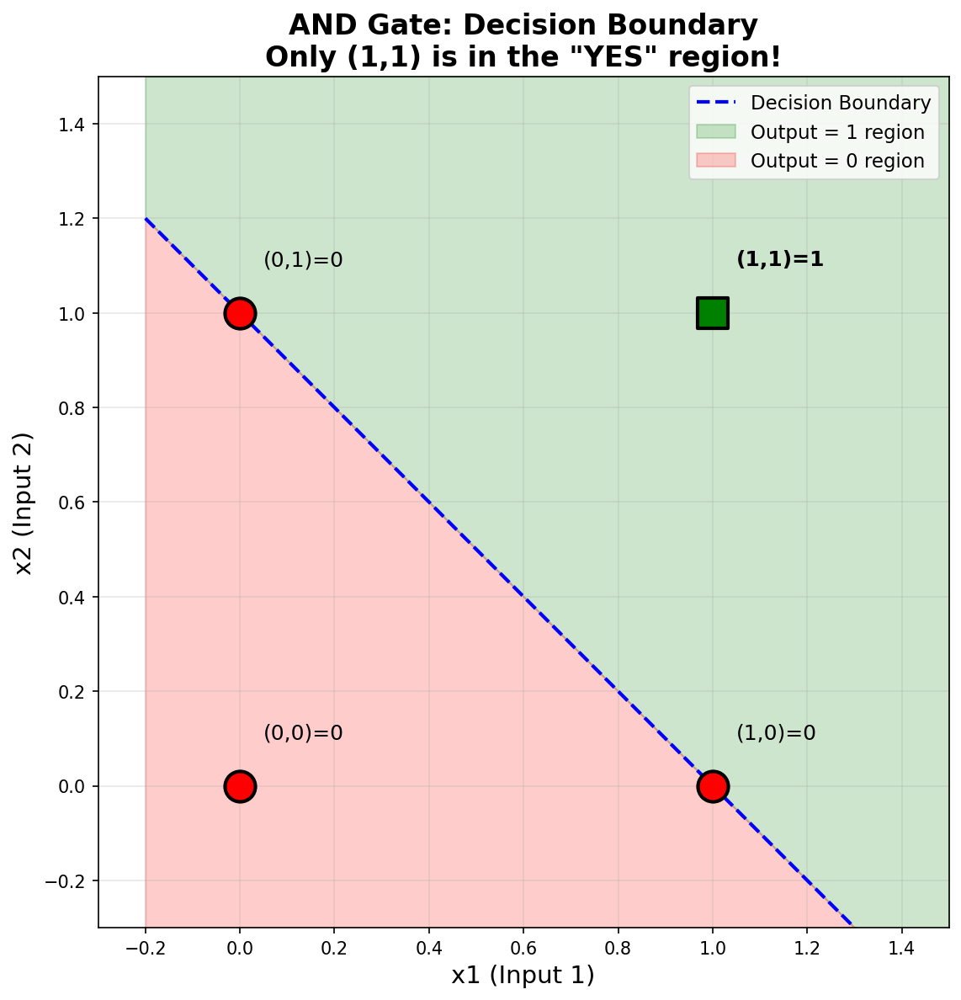
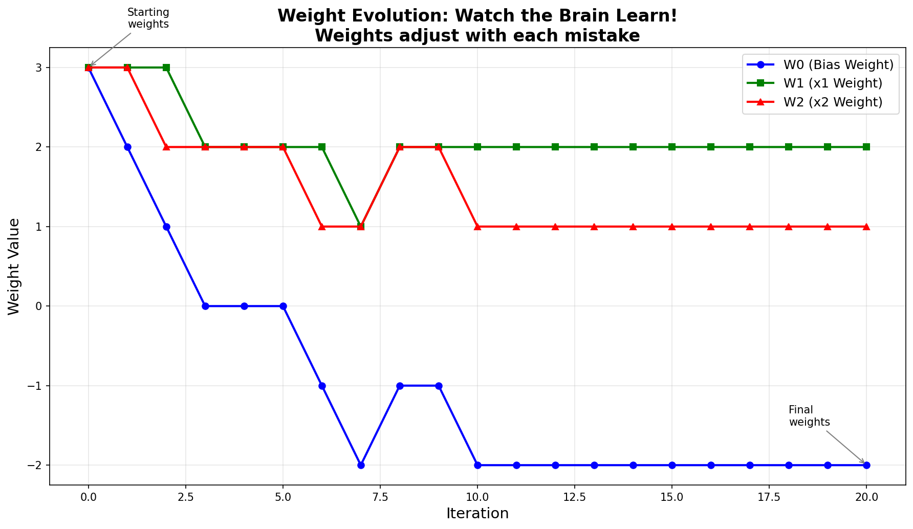
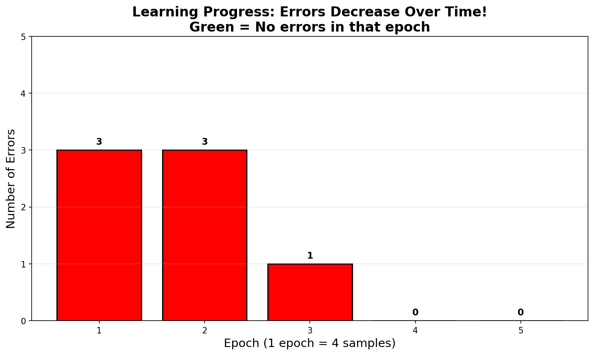

# Perceptron AND Gate - Watch AI Learn Step by Step!

*A FUN, colorful Excel file that teaches how a simple "brain" learns - designed so a 15-year-old can understand every single step!*

---

## Quick Start - Get the Excel File!

> **The main Excel file is located in the [`results/`](results/) folder:**
>
> **[`results/Perceptron_AND_Gate_Learning.xlsx`](results/Perceptron_AND_Gate_Learning.xlsx)**
>
> Download it, open in Excel, and start experimenting!

---

## What Is This?

Imagine teaching a robot to recognize when **BOTH** light switches are ON. That's what the AND gate does!

This project creates a **colorful Excel spreadsheet** that shows **exactly how the robot learns** - step by step, with colors and explanations everywhere. No mystery, no magic - just math!

**After using this project, you'll understand:**
> "Oh! So AI learning is just:
> 1. Make a guess
> 2. Check if you're right
> 3. If wrong, adjust a little
> 4. Repeat until you get it right!
>
> That's not magic at all - it's just math!"

---

## Meet the Perceptron

A **Perceptron** is the simplest possible "brain" - it takes some inputs, does some math, and gives an output.

```
        x0=1 ──[W0]──╮
                     │
        x1 ───[W1]───┼──→ [Sum] ──→ [Decision] ──→ Output (0 or 1)
                     │
        x2 ───[W2]───╯
```

**Think of it like a voting system:**
- Each input (x) casts a vote
- Each weight (W) says how important that vote is
- The sum (Z) is the total score
- If Z > 0, output YES (1). If Z <= 0, output NO (0).



---

## The AND Gate - What We're Teaching

The AND gate is like two light switches in a row - the light only turns ON when **BOTH** switches are ON!

| x1 (Switch 1) | x2 (Switch 2) | Output | Plain English |
|:-------------:|:-------------:|:------:|---------------|
| 0 (OFF) | 0 (OFF) | 0 (OFF) | Neither switch is on |
| 0 (OFF) | 1 (ON)  | 0 (OFF) | Only one switch is on |
| 1 (ON)  | 0 (OFF) | 0 (OFF) | Only one switch is on |
| 1 (ON)  | 1 (ON)  | **1 (ON)** | **BOTH switches are on!** |

**Real-world example:** Your phone unlocks only when you enter the correct PIN **AND** your finger is on the sensor.

---

## The Excel File - Screenshots & Walkthrough

> **Location:** [`results/Perceptron_AND_Gate_Learning.xlsx`](results/Perceptron_AND_Gate_Learning.xlsx)

### Screenshot 1: Welcome & Truth Table Section


*Paste your screenshot here showing the top of the Excel file*

**What this shows:**
- **Row 1**: The welcome header with the title
- **Rows 4-9**: The AND gate truth table - these are the 4 training examples the perceptron will learn from
- **Color coding**: Purple cells = inputs, Blue headers = section titles

---

### Screenshot 2: Initial Weights (The Yellow Cells!)


*Paste your screenshot here showing the initial weights section*

**What this shows:**
- **Yellow cells (C13, C14, C15)**: These are the starting weights W0, W1, W2
- **CHANGE THESE** to experiment! The entire spreadsheet will recalculate!
- Default values: W0=3, W1=3, W2=3

**Try these experiments:**
| W0 | W1 | W2 | What happens? |
|----|----|----|---------------|
| 3  | 3  | 3  | Default - learns quickly |
| 0  | 0  | 0  | Starts neutral - takes longer |
| -1 | -1 | -1 | Starts negative - different path |

---

### Screenshot 3: The Learning Table (Main Section)


*Paste your screenshot here showing the main learning iterations table*

**What this shows:**
- **20 rows** of learning iterations
- **Each row** shows one training step:
  - **Purple columns (C-E)**: Input values x0, x1, x2
  - **Yellow columns (G-I)**: Current weights before this step
  - **Orange column (J)**: The dot product Z = W*X calculation
  - **Column K**: Predicted output (0 or 1)
  - **Column L**: Error (Actual - Predicted)
  - **Column M**: Status (CORRECT or WRONG)
  - **Yellow columns (N-P)**: New weights after learning
  - **Column Q**: Visual indicator (V = correct, X = wrong)

**How to read it:**
1. Look at row 20 (iteration 1)
2. Inputs come from sample 1 of truth table: x0=1, x1=0, x2=0
3. Starting weights: W0=3, W1=3, W2=3
4. Calculation: Z = 3*1 + 3*0 + 3*0 = 3
5. Since Z > 0, Predicted = 1
6. But Actual = 0, so Error = 0 - 1 = -1 (WRONG!)
7. Weights update to fix this mistake

---

### Screenshot 4: Summary Section


*Paste your screenshot here showing the summary section at the bottom*

**What this shows:**
- **Total iterations**: 20
- **Correct count** (green): How many times the perceptron got it right
- **Wrong count** (red): How many mistakes were made
- **Final weights**: The learned W0, W1, W2 values after training

---

## The Learning Journey

Here's how the perceptron learns:

```
Start:  Random weights    → Makes lots of mistakes
        ↓ Learn from each mistake

Middle: Better weights    → Getting better!
        ↓ Keep learning

End:    Optimal weights   → All correct!
```



The graph above shows how the perceptron draws a line to separate the "YES" answers (green) from the "NO" answers (red). Only the point (1,1) - where BOTH inputs are ON - is in the YES region!

---

## Watch It Learn!

### How Weights Change Over Time

When the perceptron makes a mistake, it adjusts its weights. Watch how the weights change over 20 iterations:



### Errors Decrease Over Time

As learning progresses, the perceptron makes fewer and fewer mistakes:



---

## The Math (Simplified!)

### Step 1: Calculate (The Dot Product)
```
Z = W0 * x0 + W1 * x1 + W2 * x2
```
Think of it like adding up weighted votes!

### Step 2: Decide (The Activation)
```
If Z > 0 → Output = 1 (YES!)
If Z <= 0 → Output = 0 (NO!)
```
Like a light switch: positive = ON, negative = OFF

### Step 3: Learn (Weight Update)
```
Error = Actual - Predicted

If Error = 0  → Perfect! Don't change anything
If Error = -1 → Too confident! Reduce weights
If Error = +1 → Too cautious! Increase weights

New Weight = Old Weight + (Error * Input)
```

---

## Virtual Environment Setup (REQUIRED)

This project uses **UV** for fast, reliable package management.

### Step 1: Install UV (if not installed)

**Linux/Mac/WSL:**
```bash
curl -LsSf https://astral.sh/uv/install.sh | sh
```

**Windows PowerShell:**
```powershell
powershell -c "irm https://astral.sh/uv/install.ps1 | iex"
```

### Step 2: Create Virtual Environment

```bash
cd L29
uv venv
```

### Step 3: Activate Virtual Environment

**WSL/Linux/Mac:**
```bash
source .venv/bin/activate
```

**Windows PowerShell:**
```powershell
.venv\Scripts\activate
```

### Step 4: Install Dependencies

```bash
uv pip install -r requirements.txt
```

---

## Try It Yourself!

### Generate the Excel File
```bash
python create_excel.py
```
This creates the Excel file in: **[`results/Perceptron_AND_Gate_Learning.xlsx`](results/Perceptron_AND_Gate_Learning.xlsx)**

### Generate the Visualizations
```bash
python create_visualizations.py
```
This creates 4 PNG files in **[`results/graphs/`](results/graphs/)**

### Open the Excel File

> **Remember: The Excel file is in the [`results/`](results/) folder!**

1. Open **[`results/Perceptron_AND_Gate_Learning.xlsx`](results/Perceptron_AND_Gate_Learning.xlsx)** in Excel
2. Look at the colorful learning table
3. **Try changing the yellow cells (W0, W1, W2)** and watch everything update!

### Experiments to Try

| Experiment | Starting Weights | What Happens? |
|------------|------------------|---------------|
| Default | W0=3, W1=3, W2=3 | Learns in about 10 iterations |
| All Zeros | W0=0, W1=0, W2=0 | Takes longer to learn |
| Negative | W0=-1, W1=-1, W2=-1 | Different learning path |
| Large | W0=10, W1=10, W2=10 | Makes more mistakes initially |

---

## Project Structure

```
L29/
├── README.md                    # This file
├── create_excel.py              # Excel generator (162 lines)
├── create_visualizations.py     # Graph generator (173 lines)
├── requirements.txt             # Dependencies
├── .gitignore                   # Git ignore rules
├── venv/                        # Virtual environment indicator
│   └── .gitkeep
├── Spec/                        # Documentation
│   ├── PRD.md                   # Requirements document
│   ├── tasks.json               # Implementation tasks
│   └── PROJECT_GUIDELINES.md    # Coding standards
└── results/                     # ⭐ THE EXCEL FILE IS HERE! ⭐
    ├── Perceptron_AND_Gate_Learning.xlsx  # ⭐ The star of the show!
    └── graphs/
        ├── perceptron_diagram.png
        ├── decision_boundary.png
        ├── weight_evolution.png
        └── learning_progress.png
```

## Code Files Summary

| File | Description | Lines |
|------|-------------|-------|
| `create_excel.py` | Creates the colorful Excel file with formulas | ~162 |
| `create_visualizations.py` | Generates all 4 educational graphs | ~173 |

**Maximum Allowed:** 200 lines per file

---

## What Did We Learn?

### Key Takeaways

1. **A Perceptron is simple** - Just multiply, add, and decide!
2. **Learning is adjusting weights** - When wrong, tweak the numbers a bit
3. **The AND gate needs a line** - The perceptron draws a line to separate 0s from 1s
4. **Practice makes perfect** - More iterations = fewer mistakes

### Real-World Connections

The perceptron is the building block of modern AI:
- **Neural Networks** = Many perceptrons connected together
- **Deep Learning** = Many layers of neural networks
- **ChatGPT, Image Recognition, etc.** = Advanced versions of this basic idea!

---

## Troubleshooting

**Issue: "Module not found" error**
```
Solution: Make sure virtual environment is activated
```

**Issue: Excel formulas show as text**
```
Solution: Make sure you're opening in Excel (not a text editor)
```

**Issue: Graphs don't generate**
```
Solution: Run `uv pip install matplotlib numpy` first
```

---

## Contact & Support

**Course:** AI Developer Expert - Lesson 29
**Project:** L29-Perceptron-AND-Gate-Excel
**Version:** 2.0

---

*Making AI Education FUN, VISUAL, and ACCESSIBLE!*
